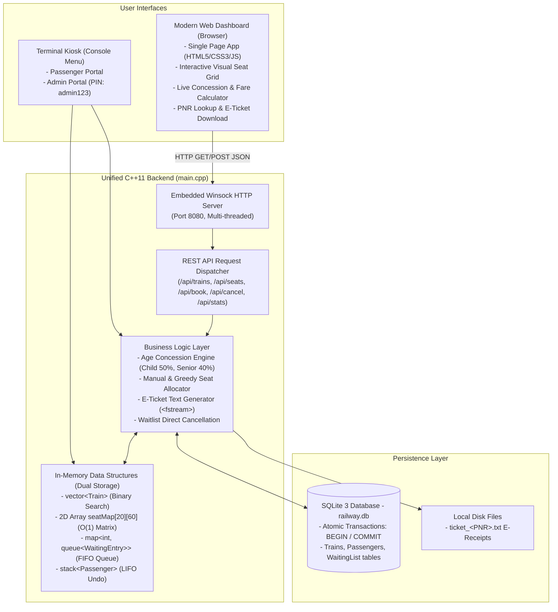

# 🚆 Railway Ticket Reservation System v2.0

[](https://isocpp.org/)
[](https://www.sqlite.org/)
[](http://localhost:8080)
[]()
[](LICENSE)
[](https://github.com/bharathwajverse/railway-ticket-reservation-cpp/actions)

A complete, full-stack **C++11** application for managing railway reservations, seat layouts, age-based fare concessions, electronic tickets, cancellations, and waiting lists using core **Data Structures and Algorithms (DSA)** integrated with an **SQLite 3** relational database (`railway.db`) and a **native embedded Winsock HTTP web dashboard** (`http://localhost:8080`).

---

## 📌 Table of Contents
- [Project Overview](#-project-overview)
- [Dual-Interface Architecture](#-dual-interface-architecture)
- [Modern Web Interface (HTML5/CSS3/JS)](#-modern-web-interface-html5css3js)
- [DSA Concepts Used](#-dsa-concepts-used)
- [Key Features](#-key-features)
- [Database Schema & ACID Transactions](#-database-schema--acid-transactions)
- [Project Structure](#-project-structure)
- [Quick Start Guide](#-quick-start-guide)
- [Edge Case Demonstrations](#-edge-case-demonstrations)
- [Contributing & Community](#-contributing--community)
- [License](#-license)

---

## 📖 Project Overview
Designed as an elite first-year college DSA mini-project for **Group 4 (B.Tech CSE - AI/ML)**, this application demonstrates the practical application of fundamental data structures (structures, 2D arrays, STL queues, vectors, maps, stacks) in a real-world scenario.

### Core Design Philosophy
- **Dual Interface System:** Interacts seamlessly via either the interactive terminal kiosk or the browser dashboard at `http://localhost:8080`.
- **Fast In-Memory Operations:** Active train models, 2D seat maps, and waiting queues operate entirely in RAM for sub-millisecond lookups.
- **Relational ACID Persistence:** Multi-table operations (booking, cancellation, auto-promotion) are wrapped in atomic transactions (`BEGIN IMMEDIATE` / `COMMIT`).
- **Zero External Dependencies:** Built with pure C++11, Windows Winsock2 (`-lws2_32`), and SQLite amalgamation. No Node.js, Python, or Apache required!

---

## 🏛️ Dual-Interface Architecture



---

## 🌐 Modern Web Interface (HTML5/CSS3/JS)

When `railway.exe` launches, an embedded background thread automatically starts a native HTTP server listening on **`http://localhost:8080`**.

### Web Features:
1. **Interactive Visual Seat Grid:** Clickable coach layout with real-time green/red seat availability. Clicking an open seat instantly chooses it for booking!
2. **Live Concession Calculator:** Dynamic real-time calculation of Senior Citizen (40% discount) and Child (50% discount) fares as age is entered.
3. **Instant PNR Lookup & E-Ticket Download:** Inspect booking status and download the official `ticket_<PNR>.txt` receipt slip directly in the browser.
4. **Live Admin Analytics Dashboard:** Visual metric cards displaying total trains, confirmed bookings, cancellations, waitlist count, and total net revenue.

### REST API Endpoints:
| Endpoint | Method | Description |
|---|---|---|
| `/` | `GET` | Serves the responsive Single-Page Application (`web/index.html`) |
| `/api/trains` | `GET` | Returns JSON array of all operational trains |
| `/api/seats?trainNo=X` | `GET` | Returns 2D seat occupancy matrix for train `X` |
| `/api/pnr?pnr=X` | `GET` | Returns passenger details, seat, concession, and fare |
| `/api/stats` | `GET` | Returns system-wide booking & revenue statistics |
| `/api/manifest` | `GET` | Returns complete passenger manifest table |
| `/api/ticket?pnr=X` | `GET` | Returns formatted plain text e-ticket slip |
| `/api/book` | `POST` | Processes booking with seat selection and concession |
| `/api/cancel` | `POST` | Cancels ticket and triggers queue auto-promotion |

---

## 💡 DSA Concepts Used

| DSA Concept | Implementation | Real-World Application in System |
|---|---|---|
| **Structures (`struct`)** | `main.cpp` (Section 1) | Groups heterogeneous properties for entities (`Train`, `Passenger`, `WaitingEntry`). |
| **Nested Structures** | `main.cpp` (Section 1) | `struct Date` (day, month, year) nested inside passenger and queue records. |
| **2D Arrays** | `main.cpp` (Section 1 & 4) | `seatMap[MAX_TRAINS][MAX_SEATS]` provides $O(1)$ random access to check/mark seat availability. |
| **1D Arrays** | `main.cpp` (Section 2) | Static lookup array for calendar month days and leap year handling. |
| **FIFO Queue (`std::queue`)** | `main.cpp` (Section 1 & 4) | Maintains waiting passengers in strict First-In, First-Out order for fair promotions. |
| **LIFO Stack (`std::stack`)** | `main.cpp` (Section 1 & 4) | Tracks recent ticket cancellations for $O(1)$ inspection and undo operations. |
| **Map (`std::map`)** | `main.cpp` (Section 1 & 4) | Associates each unique `trainNo` with its own isolated waiting queue. |
| **Dynamic Vector (`std::vector`)** | `main.cpp` (Section 1 & 4) | Dynamic storage for trains and passengers with index-based operations. |
| **Binary Search** | `main.cpp` (Section 4) | Achieves $O(\log N)$ fast lookup for trains by train number on a sorted vector. |
| **Linear Search** | `main.cpp` (Section 4) | $O(N)$ scanning for partial destination matches and PNR lookups. |
| **Bubble Sort** | `main.cpp` (Section 4) | Manual $O(N^2)$ sorting by fare or name on a copy vector for display. |
| **File I/O (`std::ofstream`)** | `main.cpp` (Section 2) | Serializes official electronic ticket slips (`ticket_<PNR>.txt`) to disk. |
| **Thread Synchronization** | `main.cpp` (Section 5) | `std::mutex` ensures thread-safe concurrent access across terminal and web requests. |

---

## ✨ Key Features

1. **Role-Based Portals:**
   - **Passenger Portal:** Train schedules, seat checking, ticket booking, cancellation, PNR status, and e-ticket export.
   - **Administrator Portal (PIN Protected: `admin123`):** Add trains, view passenger manifests, view seat grids, view waitlists, and review revenue analytics.
2. **Age-Based Fare Concessions:**
   - Child ($< 12$ years): **50% discount**.
   - Senior Citizen ($\ge 60$ years): **40% discount**.
   - General ($12 - 59$ years): Standard full fare.
3. **Manual Seat Selection & Auto-Assign:**
   - Choose exact seats from visual coach map or opt for greedy automatic seat allocation.
4. **Electronic Ticket Slip Generation (`ticket_<PNR>.txt`):**
   - Automatically writes a formatted electronic receipt with PNR, passenger info, seat, concession tier, and fare breakdown.
5. **Waiting List Management & Direct Cancellation:**
   - Automatically queues passengers (`WL-1`, `WL-2`) when seats are full.
   - Allows waiting passengers to cancel their queue spot directly without corrupting FIFO order.
6. **Cancellation & Auto-Promotion:**
   - Cancelling a ticket immediately frees the seat. If passengers are waiting, the FIFO queue head is auto-promoted into the freed seat in $O(1)$ time.
7. **Recent Cancellations & Undo (Stack - LIFO):**
   - Push cancelled tickets onto a LIFO stack. View the top cancelled ticket and restore/undo the cancellation if the seat remains vacant.
8. **Atomic SQLite Transactions:**
   - All multi-table updates are wrapped in `BEGIN IMMEDIATE TRANSACTION;` and `COMMIT;` to guarantee ACID compliance.

---

## 🗄️ Database Schema & ACID Transactions

The database uses a single portable file: `railway.db`.

```sql
-- 1. Trains Table
CREATE TABLE IF NOT EXISTS trains (
  train_no INTEGER PRIMARY KEY,
  name TEXT NOT NULL,
  source TEXT NOT NULL,
  destination TEXT NOT NULL,
  departure TEXT NOT NULL,
  total_seats INTEGER NOT NULL,
  available_seats INTEGER NOT NULL,
  fare REAL NOT NULL
);

-- 2. Passengers Table
CREATE TABLE IF NOT EXISTS passengers (
  pnr INTEGER PRIMARY KEY,
  name TEXT NOT NULL,
  age INTEGER NOT NULL,
  gender TEXT NOT NULL,
  train_no INTEGER NOT NULL,
  seat_no INTEGER NOT NULL,
  day INTEGER NOT NULL,
  month INTEGER NOT NULL,
  year INTEGER NOT NULL,
  status TEXT NOT NULL,
  concession TEXT DEFAULT 'GENERAL',
  fare_paid REAL DEFAULT 0.0
);

-- 3. Waiting List Table
CREATE TABLE IF NOT EXISTS waiting_list (
  wait_id INTEGER PRIMARY KEY AUTOINCREMENT,
  name TEXT NOT NULL,
  age INTEGER NOT NULL,
  gender TEXT NOT NULL,
  train_no INTEGER NOT NULL,
  day INTEGER NOT NULL,
  month INTEGER NOT NULL,
  year INTEGER NOT NULL
);
```

---

## 📂 Project Structure

```text
railway-ticket-reservation-cpp/
├── .github/
│   ├── ISSUE_TEMPLATE/
│   │   ├── bug_report.md       # Pre-formatted bug report issue template
│   │   └── feature_request.md  # Idea and algorithm proposal template
│   ├── pull_request_template.md # Contribution PR checklist
│   └── workflows/
│       └── build.yml           # Automated multi-platform CI build pipeline
├── web/
│   └── index.html              # Modern responsive Single Page App (HTML5/CSS3/JS)
├── main.cpp                    # Complete, all-in-one C++ application with detailed comments
├── sqlite3.c / sqlite3.h       # Official SQLite 3 amalgamation C source
├── run.bat                     # Single-click Windows compile & launch script
├── build.bat                   # Single-command Windows build script
├── Makefile                    # Single-command Linux/macOS build script
├── CHANGELOG.md                # Semantic versioning release history
├── CONTRIBUTING.md             # Contribution guidelines & coding standards
├── CODE_OF_CONDUCT.md          # Contributor Covenant Code of Conduct
├── LICENSE                     # MIT Open-Source License
└── README.md                   # Project documentation
```

---

## 🚀 Quick Start Guide

### Prerequisites
- Any C++11 compliant compiler (`g++`, `clang++`, or MinGW).
- Standard C runtime library.

### Windows (Single-Click Launcher)
Double-click **`run.bat`** (or execute in PowerShell/CMD):
```cmd
run.bat
```
Then open your web browser to **`http://localhost:8080`** to access the modern web dashboard!

Or compile manually:
```cmd
build.bat
railway.exe
```

### Linux / macOS (Using `Makefile`)
```bash
# 1. Clone repository
git clone https://github.com/bharathwajverse/railway-ticket-reservation-cpp.git
cd railway-ticket-reservation-cpp

# 2. Compile using make
make

# 3. Launch application
./railway
```

### Command-Line Flags
```cmd
railway.exe --version   # Displays software version and project metadata
railway.exe --help      # Displays command-line argument help
```

---

## 🧪 Edge Case Demonstrations

1. **Age Concessions Calculation:**
   - Age 8: Child 50% discount automatically applied.
   - Age 65: Senior Citizen 40% discount automatically applied.
2. **Full Train $\to$ Waiting Queue:**
   - Train `#10303` fills up. The next booking automatically enqueues to `WL-1` in the train's FIFO queue.
3. **Cancellation $\to$ Auto-Promotion:**
   - Cancelling a confirmed ticket triggers `promoteFromWaitingList()`, promoting the waiting passenger to the newly freed seat with a new PNR in $O(1)$ queue time.
4. **Direct Waitlist Cancellation:**
   - Passengers in the waiting queue can cancel directly; the queue temporarily filters and restores in FIFO order.
5. **Recent Cancellations & Undo (Stack):**
   - Push cancelled tickets onto a LIFO stack. View the most recently cancelled ticket and restore/undo the cancellation if the seat remains vacant.
6. **Duplicate Ticket Prevention:**
   - Attempting to book the same passenger name on the same train and date is politely rejected.

---

## 🤝 Contributing & Community
- Review our [Contributing Guidelines](CONTRIBUTING.md) to propose enhancements or algorithms.
- Read our [Code of Conduct](CODE_OF_CONDUCT.md) for community standards.
- Check [CHANGELOG.md](CHANGELOG.md) for full release history.

---

## 📄 License
This project is open-source under the [MIT License](LICENSE).
