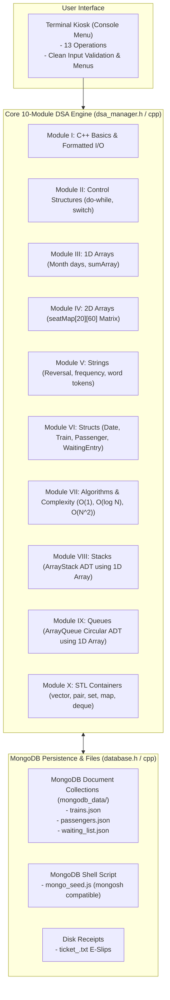

# 🚆 Railway Ticket Reservation System

[](https://isocpp.org/)
[](https://www.mongodb.com/)
[](#-10-syllabus-modules-mapping)
[]()
[](LICENSE)
[](https://github.com/bharathwajverse/railway-ticket-reservation-cpp/actions)

A complete, high-performance **C++11** Railway Ticket Reservation System designed strictly around **10 core Data Structures and Programming Modules**, backed by a separated **MongoDB Document Database Layer** (`mongodb_data/` collections: `trains.json`, `passengers.json`, `waiting_list.json`) and automated **MongoDB Shell (`mongosh`) script generation** (`mongo_seed.js`).

---

## 📌 Table of Contents
- [Project Overview](#-project-overview)
- [System Architecture](#-system-architecture)
- [10 Syllabus Modules Mapping](#-10-syllabus-modules-mapping)
- [Key Features](#-key-features)
- [MongoDB Collections & Document Schema](#-mongodb-collections--document-schema)
- [Project Structure](#-project-structure)
- [Quick Start Guide](#-quick-start-guide)
- [Interactive Web UI Preview](#-interactive-web-ui-preview)
- [Edge Case Demonstrations](#-edge-case-demonstrations)
- [Contributing & Community](#-contributing--community)
- [License](#-license)

---

## 📖 Project Overview
A modular, readable, and standard-compliant C++ application engineered to showcase fundamental Computer Science and Data Structure principles in a real-world scenario. The system handles train discovery, seat matrix allocation, age concessions, atomic transactions, waiting lists with automatic promotion, and cancellation undo operations.

### Core Design Principles
- **Strictly Modular (10 Modules):** Direct 1-to-1 mapping with academic Computer Science syllabus modules.
- **Pure Standard C++11:** Zero external driver dependencies. Compiles instantly with GCC/Clang on Windows, Linux, and macOS.
- **Fast In-Memory Data Structures:** In-memory 2D seat maps ($O(1)$), binary search on sorted trains ($O(\log N)$), circular array queues, and array-based stacks.
- **MongoDB NoSQL Persistence:** Document-oriented storage in `mongodb_data/` synchronized with a mongosh-compatible `mongo_seed.js` script.

---

## 🏛️ System Architecture



---

## 💡 10 Syllabus Modules Mapping

Every aspect of the system maps directly to the 10 fundamental modules:

| Module | Topic | Implementation in `dsa_manager.cpp` | Complexity / Concept |
|---|---|---|---|
| **Module I** | **C++ Basics & I/O** | `cin`, `cout`, `<iomanip>` stream manipulators (`setw`, `setfill`), explicit type casting | $O(1)$ stream I/O |
| **Module II** | **Control Structures** | `do-while` main loop, `switch-case` menu dispatcher, `if-else` date/seat validation | Decision branching |
| **Module III** | **1D Arrays** | `daysInMonth[]` calendar table, passing arrays to functions (`sum1DArray`) | $O(1)$ calendar indexing |
| **Module IV** | **2D Arrays** | `seatMap[MAX_TRAINS][MAX_SEATS]` coach layout matrix | $O(1)$ seat inspection |
| **Module V** | **Strings** | `reverseString()` (reversal), `countCharFrequency()` (frequency), `tokenizeRoute()` (tokens) | Text manipulation |
| **Module VI** | **Structures** | `struct Date`, `Train`, `Passenger`, `WaitingEntry`, nested date structs | Heterogeneous records |
| **Module VII** | **Complexity & Algorithms** | $O(1)$ matrix indexing, $O(\log N)$ Binary Search, $O(N)$ Linear Search, $O(N^2)$ Bubble Sort | Algorithm analysis |
| **Module VIII** | **Stacks** | Custom `ArrayStack` (Stack ADT using static 1D array) for LIFO undo | $O(1)$ push / pop undo |
| **Module IX** | **Queues** | Custom `ArrayQueue` (Circular Queue ADT using 1D array) for FIFO waiting list | $O(1)$ push / pop fairness |
| **Module X** | **STL Containers** | `std::pair` (summaries), `std::vector`, `std::set` (unique stations), `std::map`, `std::deque` | Standard Template Library |

---

## 🗄️ MongoDB Collections & Document Schema

Data is stored as document collections inside the `mongodb_data/` directory:

### 1. `trains.json` (Collection: `trains`)
```json
[
  {
    "_id": "6701a1b2c3d4e5f600000001",
    "train_no": 10101,
    "name": "Rajdhani Express",
    "source": "Delhi",
    "destination": "Mumbai",
    "departure": "06:00 AM",
    "total_seats": 4,
    "available_seats": 4,
    "fare": 1500.00
  }
]
```

### 2. `passengers.json` (Collection: `passengers`)
```json
[
  {
    "_id": "6701a1b2c3d4e5f600000101",
    "pnr": 1001,
    "name": "John Doe",
    "age": 25,
    "gender": "M",
    "train_no": 10101,
    "seat_no": 1,
    "travel_date": {
      "day": 15,
      "month": 11,
      "year": 2026
    },
    "status": "CONFIRMED",
    "concession": "GENERAL",
    "fare_paid": 1500.00
  }
]
```

### 3. Synchronizing to MongoDB Atlas (`datadb`)
The system targets your MongoDB Atlas cluster (`cluster0.xhjfpv2.mongodb.net`) and database **`datadb`**.

To push all collections directly to MongoDB Atlas:
1. Select **Option 13** (*Sync Collections to MongoDB Atlas*) from the interactive menu, OR
2. Double-click **`sync_to_atlas.bat`**, OR
3. Run via MongoDB Shell:
```bash
mongosh "mongodb+srv://<username>:<password>@cluster0.xhjfpv2.mongodb.net/datadb?appName=Cluster0" mongo_seed.js
```

> [!TIP]
> If connecting to MongoDB Atlas, ensure your IP address is allowed in the MongoDB Atlas dashboard under **Network Access** $\to$ **Add IP Address** (or select **Allow Access from Anywhere** `0.0.0.0/0`).

---

## 📂 Project Structure

```text
railway-ticket-reservation-cpp/
├── .github/
│   ├── ISSUE_TEMPLATE/
│   │   ├── bug_report.md          # Pre-formatted bug report issue template
│   │   └── feature_request.md     # Idea and algorithm proposal template
│   ├── pull_request_template.md    # Contribution PR checklist
│   └── workflows/
│       └── build.yml              # Automated multi-platform CI build pipeline
├── mongodb_data/                  # MongoDB NoSQL Document Collections (JSON)
│   ├── trains.json                # Trains document collection
│   ├── passengers.json            # Confirmed passengers document collection
│   └── waiting_list.json          # Waiting queue document collection
├── mongo_seed.js                  # Auto-generated mongosh shell initialization script
├── database.h / database.cpp      # Completely isolated MongoDB document persistence layer
├── dsa_manager.h / dsa_manager.cpp# Unified DSA engine implementing syllabus Modules I through X & DSAManager
├── main.cpp                       # Modular entry-point application driver
├── web/
│   └── index.html                 # Modern responsive Single Page App (HTML5/CSS3/JS)
├── run.bat                        # Single-click Windows compile & launch script
├── build.bat                      # Single-command Windows build script
├── Makefile                       # Single-command Linux/macOS build script
├── CHANGELOG.md                   # Semantic versioning release history
├── CONTRIBUTING.md                # Contribution guidelines & coding standards
├── CODE_OF_CONDUCT.md             # Contributor Covenant Code of Conduct
├── LICENSE                        # MIT Open-Source License
└── README.md                      # Project documentation
```

---

## 🚀 Quick Start Guide

### Prerequisites
- Any C++11 compliant compiler (`g++`, `clang++`, or MinGW).
- Standard C runtime library.

### Windows (Single-Click Launcher)
Double-click **`run.bat`** (or execute in PowerShell/CMD):
```cmd
run.bat
```
This will compile `railway.exe` (if not already compiled) and launch the interactive 11-option terminal menu.

Or compile manually:
```cmd
build.bat
railway.exe
```

### Linux / macOS (Using `Makefile`)
```bash
# 1. Clone repository
git clone https://github.com/bharathwajverse/railway-ticket-reservation-cpp.git
cd railway-ticket-reservation-cpp

# 2. Compile using make
make

# 3. Launch application
./railway
```

---

## 🌐 Interactive Web UI Preview

An interactive Single-Page Application (HTML5/CSS3/JavaScript) is provided in `web/index.html`. Double-click or open `web/index.html` in any browser to explore the conceptual web dashboard, including:
- Visual coach seat layout grid
- Real-time age-based concession calculator
- E-Ticket preview & receipt generator
- Admin analytics overview

---

## 🧪 Edge Case Demonstrations

1. **Age Concessions Calculation:**
   - Age 8: Child 50% discount automatically applied.
   - Age 65: Senior Citizen 40% discount automatically applied.
2. **Full Train $\to$ Waiting Queue:**
   - Train `#10303` fills up. The next booking automatically enqueues to `WL-1` in the train's FIFO queue.
3. **Cancellation $\to$ Auto-Promotion:**
   - Cancelling a confirmed ticket triggers `promoteFromWaitingList()`, promoting the waiting passenger to the newly freed seat with a new PNR in $O(1)$ queue time.
4. **Direct Waitlist Cancellation:**
   - Passengers in the waiting queue can cancel directly; the queue temporarily filters and restores in FIFO order.
5. **Recent Cancellations & Undo (Stack):**
   - Push cancelled tickets onto a LIFO stack. View the most recently cancelled ticket and restore/undo the cancellation if the seat remains vacant.
6. **Duplicate Ticket Prevention:**
   - Attempting to book the same passenger name on the same train and date is politely rejected.

---

## 🤝 Contributing & Community
- Review our [Contributing Guidelines](CONTRIBUTING.md) to propose enhancements or algorithms.
- Read our [Code of Conduct](CODE_OF_CONDUCT.md) for community standards.
- Check [CHANGELOG.md](CHANGELOG.md) for full release history.

---

## 📄 License
This project is open-source under the [MIT License](LICENSE).
