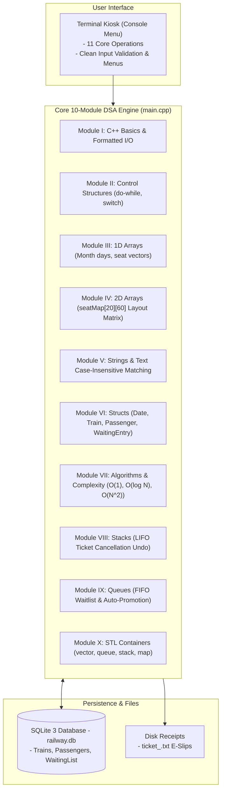

# 🚆 Railway Ticket Reservation System

[](https://isocpp.org/)
[](https://www.sqlite.org/)
[](#-10-syllabus-modules-mapping)
[]()
[](LICENSE)
[](https://github.com/bharathwajverse/railway-ticket-reservation-cpp/actions)

A complete, high-performance **C++11** Railway Ticket Reservation System designed strictly around **10 core Data Structures and Programming Modules**, synchronized with an embedded **SQLite 3** relational database (`railway.db`) and persistent disk file generation for electronic ticket slips.

---

## 📌 Table of Contents
- [Project Overview](#-project-overview)
- [System Architecture](#-system-architecture)
- [10 Syllabus Modules Mapping](#-10-syllabus-modules-mapping)
- [Key Features](#-key-features)
- [Database Schema & ACID Transactions](#-database-schema--acid-transactions)
- [Project Structure](#-project-structure)
- [Quick Start Guide](#-quick-start-guide)
- [Interactive Web UI Preview](#-interactive-web-ui-preview)
- [Edge Case Demonstrations](#-edge-case-demonstrations)
- [Contributing & Community](#-contributing--community)
- [License](#-license)

---

## 📖 Project Overview
A modular, readable, and standard-compliant C++ application engineered to showcase fundamental Computer Science and Data Structure principles in a real-world scenario. The system handles train discovery, seat matrix allocation, age concessions, atomic transactions, waiting lists with automatic promotion, and cancellation undo operations.

### Core Design Principles
- **Strictly Modular (10 Modules):** Direct 1-to-1 mapping with academic Computer Science syllabus modules.
- **Pure Standard C++11:** No complex external networking dependencies, socket threads, or platform locks. Runs anywhere with a standard C++ compiler.
- **Fast In-Memory Data Structures:** In-memory 2D seat maps ($O(1)$), binary search on sorted trains ($O(\log N)$), FIFO waitlists, and LIFO cancellation stacks.
- **ACID Persistence:** Embedded SQLite 3 database (`railway.db`) preserves train fleets, passenger manifests, and waiting queues across reboots.

---

## 🏛️ System Architecture



---

## 💡 10 Syllabus Modules Mapping

Every aspect of `main.cpp` maps directly to the 10 fundamental modules:

| Module | Topic | Implementation in `main.cpp` | Complexity / Concept |
|---|---|---|---|
| **Module I** | **C++ Basics & I/O** | `cin`, `cout`, `<iomanip>` stream manipulators, formatting tables | $O(1)$ stream I/O |
| **Module II** | **Control Structures** | `do-while` main loop, `switch-case` menu dispatcher, `if-else` date/seat validation | Decision branching |
| **Module III** | **1D Arrays** | `daysInMonth[]` leap year array, boolean seat checks | $O(1)$ calendar indexing |
| **Module IV** | **2D Arrays** | `seatMap[MAX_TRAINS][MAX_SEATS]` coach layout matrix | $O(1)$ seat inspection |
| **Module V** | **Strings** | `std::string`, `toLowerCase()`, `containsIgnoreCase()` substring search | Text manipulation |
| **Module VI** | **Structures** | `struct Date`, `Train`, `Passenger`, `WaitingEntry`, `RailwaySystem` | Heterogeneous records |
| **Module VII** | **Complexity & Algorithms** | $O(1)$ matrix indexing, $O(\log N)$ Binary Search, $O(N)$ Linear Search, $O(N^2)$ Bubble Sort | Algorithm analysis |
| **Module VIII** | **Stacks** | `std::stack<Passenger> recentCancellations` for LIFO undo | $O(1)$ push / pop undo |
| **Module IX** | **Queues** | `std::queue<WaitingEntry>` FIFO waiting list with auto-promotion | $O(1)$ push / pop fairness |
| **Module X** | **STL Containers** | `std::vector`, `std::queue`, `std::stack`, `std::map` | Standard Template Library |

---
---

## ✨ Key Features

1. **Role-Based Portals:**
   - **Passenger Portal:** Train schedules, seat checking, ticket booking, cancellation, PNR status, and e-ticket export.
   - **Administrator Portal (PIN Protected):** Add trains, view passenger manifests, view seat grids, view waitlists, and review revenue analytics.
2. **Age-Based Fare Concessions:**
   - Child ($< 12$ years): **50% discount**.
   - Senior Citizen ($\ge 60$ years): **40% discount**.
   - General ($12 - 59$ years): Standard full fare.
3. **Manual Seat Selection & Auto-Assign:**
   - Choose exact seats from visual coach map or opt for greedy automatic seat allocation.
4. **Electronic Ticket Slip Generation (`ticket_<PNR>.txt`):**
   - Automatically writes a formatted electronic receipt with PNR, passenger info, seat, concession tier, and fare breakdown.
5. **Waiting List Management & Direct Cancellation:**
   - Automatically queues passengers (`WL-1`, `WL-2`) when seats are full.
   - Allows waiting passengers to cancel their queue spot directly without corrupting FIFO order.
6. **Cancellation & Auto-Promotion:**
   - Cancelling a ticket immediately frees the seat. If passengers are waiting, the FIFO queue head is auto-promoted into the freed seat in $O(1)$ time.
7. **Recent Cancellations & Undo (Stack - LIFO):**
   - Push cancelled tickets onto a LIFO stack. View the top cancelled ticket and restore/undo the cancellation if the seat remains vacant.
8. **Atomic SQLite Transactions:**
   - All multi-table updates are wrapped in `BEGIN IMMEDIATE TRANSACTION;` and `COMMIT;` to guarantee ACID compliance.

---

## 🗄️ Database Schema & ACID Transactions

The database uses a single portable file: `railway.db`.

```sql
-- 1. Trains Table
CREATE TABLE IF NOT EXISTS trains (
  train_no INTEGER PRIMARY KEY,
  name TEXT NOT NULL,
  source TEXT NOT NULL,
  destination TEXT NOT NULL,
  departure TEXT NOT NULL,
  total_seats INTEGER NOT NULL,
  available_seats INTEGER NOT NULL,
  fare REAL NOT NULL
);

-- 2. Passengers Table
CREATE TABLE IF NOT EXISTS passengers (
  pnr INTEGER PRIMARY KEY,
  name TEXT NOT NULL,
  age INTEGER NOT NULL,
  gender TEXT NOT NULL,
  train_no INTEGER NOT NULL,
  seat_no INTEGER NOT NULL,
  day INTEGER NOT NULL,
  month INTEGER NOT NULL,
  year INTEGER NOT NULL,
  status TEXT NOT NULL,
  concession TEXT DEFAULT 'GENERAL',
  fare_paid REAL DEFAULT 0.0
);

-- 3. Waiting List Table
CREATE TABLE IF NOT EXISTS waiting_list (
  wait_id INTEGER PRIMARY KEY AUTOINCREMENT,
  name TEXT NOT NULL,
  age INTEGER NOT NULL,
  gender TEXT NOT NULL,
  train_no INTEGER NOT NULL,
  day INTEGER NOT NULL,
  month INTEGER NOT NULL,
  year INTEGER NOT NULL
);
```

---

## 📂 Project Structure

```text
railway-ticket-reservation-cpp/
├── .github/
│   ├── ISSUE_TEMPLATE/
│   │   ├── bug_report.md       # Pre-formatted bug report issue template
│   │   └── feature_request.md  # Idea and algorithm proposal template
│   ├── pull_request_template.md # Contribution PR checklist
│   └── workflows/
│       └── build.yml           # Automated multi-platform CI build pipeline
├── web/
│   └── index.html              # Modern responsive Single Page App (HTML5/CSS3/JS)
├── main.cpp                    # Complete, all-in-one C++ application with detailed comments
├── sqlite3.c / sqlite3.h       # Official SQLite 3 amalgamation C source
├── run.bat                     # Single-click Windows compile & launch script
├── build.bat                   # Single-command Windows build script
├── Makefile                    # Single-command Linux/macOS build script
├── CHANGELOG.md                # Semantic versioning release history
├── CONTRIBUTING.md             # Contribution guidelines & coding standards
├── CODE_OF_CONDUCT.md          # Contributor Covenant Code of Conduct
├── LICENSE                     # MIT Open-Source License
└── README.md                   # Project documentation
```

---

## 🚀 Quick Start Guide

### Prerequisites
- Any C++11 compliant compiler (`g++`, `clang++`, or MinGW).
- Standard C runtime library.

### Windows (Single-Click Launcher)
Double-click **`run.bat`** (or execute in PowerShell/CMD):
```cmd
run.bat
```
This will compile `railway.exe` (if not already compiled) and launch the interactive 11-option terminal menu.

Or compile manually:
```cmd
build.bat
railway.exe
```

### Linux / macOS (Using `Makefile`)
```bash
# 1. Clone repository
git clone https://github.com/bharathwajverse/railway-ticket-reservation-cpp.git
cd railway-ticket-reservation-cpp

# 2. Compile using make
make

# 3. Launch application
./railway
```

---

## 🌐 Interactive Web UI Preview

An interactive Single-Page Application (HTML5/CSS3/JavaScript) is provided in `web/index.html`. Double-click or open `web/index.html` in any browser to explore the conceptual web dashboard, including:
- Visual coach seat layout grid
- Real-time age-based concession calculator
- E-Ticket preview & receipt generator
- Admin analytics overview

---

## 🧪 Edge Case Demonstrations

1. **Age Concessions Calculation:**
   - Age 8: Child 50% discount automatically applied.
   - Age 65: Senior Citizen 40% discount automatically applied.
2. **Full Train $\to$ Waiting Queue:**
   - Train `#10303` fills up. The next booking automatically enqueues to `WL-1` in the train's FIFO queue.
3. **Cancellation $\to$ Auto-Promotion:**
   - Cancelling a confirmed ticket triggers `promoteFromWaitingList()`, promoting the waiting passenger to the newly freed seat with a new PNR in $O(1)$ queue time.
4. **Direct Waitlist Cancellation:**
   - Passengers in the waiting queue can cancel directly; the queue temporarily filters and restores in FIFO order.
5. **Recent Cancellations & Undo (Stack):**
   - Push cancelled tickets onto a LIFO stack. View the most recently cancelled ticket and restore/undo the cancellation if the seat remains vacant.
6. **Duplicate Ticket Prevention:**
   - Attempting to book the same passenger name on the same train and date is politely rejected.

---

## 🤝 Contributing & Community
- Review our [Contributing Guidelines](CONTRIBUTING.md) to propose enhancements or algorithms.
- Read our [Code of Conduct](CODE_OF_CONDUCT.md) for community standards.
- Check [CHANGELOG.md](CHANGELOG.md) for full release history.

---

## 📄 License
This project is open-source under the [MIT License](LICENSE).
